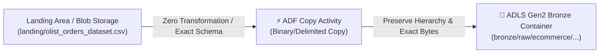

# 🏭 Azure Data Factory (ADF) Bronze Ingestion Pipeline

This folder contains the Azure Data Factory definitions for ingesting raw transactional CSV datasets directly into Azure Data Lake Storage Gen2 (ADLS Gen2) `bronze/` container.

---

## 📄 Included Assets

1. **`pipeline_copy_bronze_csv.json`**: Standalone pipeline JSON definition for ADF Studio containing the `Copy` data activity.
2. **`arm_template_bronze_ingestion.json`**: Complete Azure Resource Manager (ARM) template provisioning the Linked Services, Datasets, and Pipeline.

---

## ⚙️ Architecture & Features



- **Zero Schema Mutation**: Performs a high-throughput binary or delimited direct stream copy preserving exact column headers, byte arrays, encoding, and raw strings.
- **Data Consistency Verification**: Enabled via `validateDataConsistency: true` in the copy activity.
- **Dynamic Parameterization**: Accepts `SourceContainerOrUrl`, `SourceFileName`, `DestinationContainer`, and `DestinationDirectory` at trigger time or from tumbling window schedules.

---

## 🚀 Deployment Methods

### Option 1: Direct Import into ADF Studio
1. Open [Azure Data Factory Studio](https://adf.azure.com/).
2. Under **Author** > **Pipelines**, click `...` and choose **Import pipeline from template / JSON**.
3. Select `pipeline_copy_bronze_csv.json`.
4. Map the input/output dataset connections to your ADLS Gen2 linked service.
5. Click **Publish all**.

### Option 2: Deploy via Azure CLI (ARM Template)
```bash
az deployment group create \
  --resource-group rg-lakehouse-prod \
  --template-file templates/adf/arm_template_bronze_ingestion.json \
  --parameters \
      factoryName=adf-lakehouse-medallion \
      adlsGen2StorageAccount=stlakehousemedallion \
      adlsGen2Endpoint=https://stlakehousemedallion.dfs.core.windows.net
```
